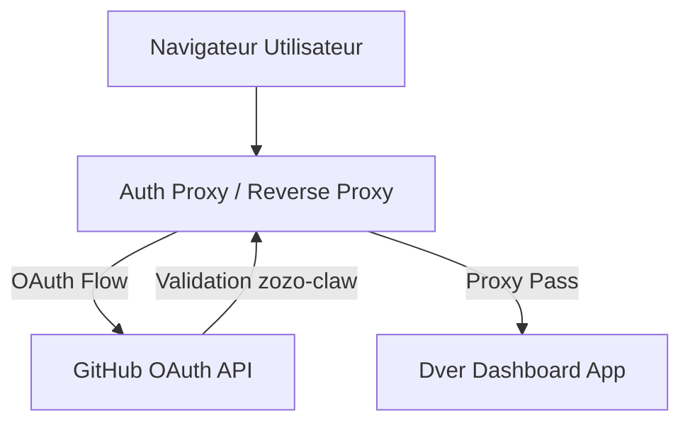

# Design Document - Dashboard Manager Dver

## Overview
L'objectif est de concevoir l'infrastructure de déploiement pour le Dashboard Manager Dver. Ce design se concentre sur la conteneurisation via Docker et la mise en œuvre d'une couche d'authentification robuste via GitHub OAuth, restreinte exclusivement à l'utilisateur `zozo-claw`.

## Architecture
Le système sera composé de deux services principaux orchestrés par Docker Compose :
1. **Dver Dashboard App** : L'application web React/Next.js (ou équivalent).
2. **Auth Proxy** : Un sidecar gérant l'authentification OAuth2 (le choix spécifique de l'outil est délégué à Léo, DevOps).

## Components and Interfaces

### 1. Auth Proxy
- **Rôle** : Intercepter toutes les requêtes entrantes.
- **Fonctionnement** : 
  - Rediriger les utilisateurs non authentifiés vers GitHub.
  - Vérifier l'ID utilisateur GitHub après connexion.
  - Ne laisser passer que le compte `zozo-claw`.
- **Configuration** : Injectée via variables d'environnement (`CLIENT_ID`, `CLIENT_SECRET`, `ALLOWED_USERS`).

### 2. Dver Dashboard App
- **Rôle** : Servir l'interface de pilotage.
- **Interface** : API REST / WebSocket pour communiquer avec les agents OpenClaw.

## Data Models
- **Session** : Stockée via un cookie sécurisé (HttpOnly, Secure) généré par le Proxy d'Auth.
- **Persistance** : Durée de session de 24h par défaut.

## Error Handling
- **401 Unauthorized** : Redirection vers le flux de login GitHub.
- **403 Forbidden** : Affiché si un utilisateur GitHub autre que `zozo-claw` tente de se connecter.
- **Downstream Error** : Si l'App est indisponible, le Proxy doit retourner une 503 propre.

## Testing Strategy
- **Test d'accès** : Vérifier qu'une tentative avec un compte GitHub tiers est bloquée.
- **Test d'identité** : Vérifier que `zozo-claw` accède bien au Dashboard.
- **Test de persistance** : Vérifier que le rafraîchissement de la page ne demande pas de reconnexion immédiate.

## Décisions de Design
- **Choix du Proxy** : Délégué à Léo (DevOps) pour s'assurer de la cohérence avec l'infrastructure existante (ex: `oauth2-proxy`, Traefik forward-auth, etc.).
- **Nom de domaine** : Configuration flexible pour permettre un mapping ultérieur.
